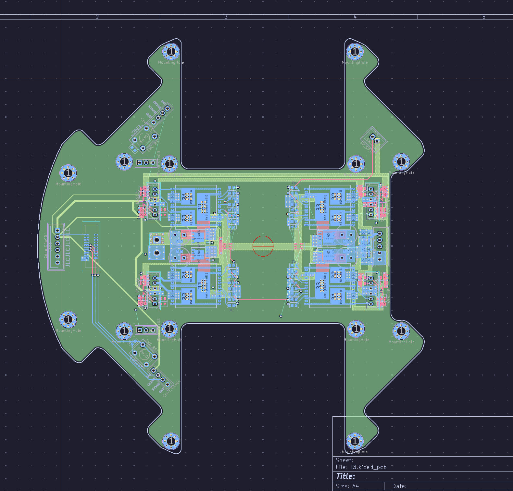

import Callout from '@/components/Callout.astro'

<Callout title="mentally unsound behaviour" variant="danger">
  The design of this PCB is extremely cancerous and has a high risk of causing a migraine. This design was made by a mentally unstable individual who has little regard for self-preservation. 
  
  **Please proceed with caution.**
</Callout>
## Teensys suck
For our robot, our processing unit is a PCB which is directly on top of our main chassis (houses our motors, kickers, dribblers and light ring). In 2025, we used a Teensy 4.0 for our main processing, and an STM32F401CCU6 to control motors, and 4 VNH5019 motor drivers. 

This, however, is really *fucking* stupid when you think about it; instead of directly controlling our motors from the Teensy which is the microcontroller calculating how our motors should be driven, we have to send the motor PWM values over to the slave STM which then just drives the motors, which is inefficient as shit. We *would* have directly connected the motor driver pins to the Teensy, but the Teensy 4.0 has very few pins and we already used almost all of them for our different serials.

Another issue is that the Teensy is just pretty tall. There's not a lot of space in a Robocup robot to begin with (the height limit is 18cm) and the Teensy's height just pushes everything up, decreasing the distance between our camera and our mirror which affects our vision systems.

The Teensy seems like the root of all evil on the PCB. Logically speaking, we should remove the Teensy and if we cross our fingers and hope for the best, everything should work even better!

## Removing the Teensy sucks more!
I really did not cross my fingers hard enough.

The plan seems really simple on the surface - remove the Teensy, replace it with another STM. Heck, we even found another STM32F4 (the STM32F411CE) which was even beefier than the STM32F401CCU6 we were using and simulatenously even cheaper.

Unfortunately, Faraday is a little bitch and having 2 STMs on the same PCB is *horrible*.

### Routing
I don't think this needs much explanation but routing 2 STMs on the same PCB, along with 4 motor drivers, is really convoluted. We opted for QFN48 packages for our STMs and 2 of those gives us 96 pins just between the two microcontrollers. 

### Impedance
Even more annoyingly, there's this annoying physics thing called impedance. Usually, on a 2 layer PCB which most sane hobbyists use, signal traces cut through your GND plane. This isn't *too* bad when you just have 1 microcontroller, because there isn't too much noise. With 2 STM32s which are running an entire robot between the two of them though, this issue gets magnified and a lot of noise is created in our signal traces because the return currents cannot flow to GND easily.

Using a 4 layer PCB solves a lot of these problems. 2 of your layers can be dedicated to GND and power planes which make return paths shorter, reducing noise and creating more stable reference voltages, and creates lower impedance power supply to the STMs and motor drivers.

The main issue with that is that no one in Hwa Chong Robotics has made a 4 layer PCb before. Granted, no one has ever made such a convoluted robot before, but I guess there's a first time for everything. 

## 4 layer PCBs are like vacuum cleaners
They suck. 

I cannot describe the sheer pain I had to go through designing a 4 layer PCB for the first time. I first messed around with routing the motor drivers (as they weren't going to change from my previous PCB).

This was the most disgusting looking PCB I ever designed, which is quite surprising considering that I made some atrocious looking PCBs in my first year doing elec.